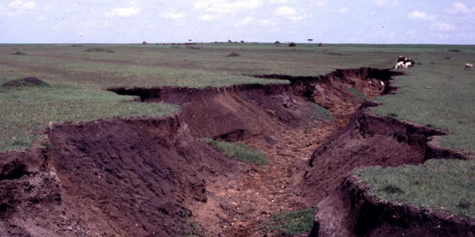

:::: {.grid}

::: {.g-col-md-6 .g-col-12 .mt-3}

# Soil erosion

Soil erosion is a major threat to sustainability and productivity with knock-on effects on the climate crisis and food security. It decreases soil fertility negatively affecting crop yields on fields, while eroded sediments from upstream clog downstream, dams, rivers and canals causing sedimentation and flooding. This is particularly true for hilly areas in Ethiopia, Kenya and Rwanda with high erosion risk. Soil erosion can be prevented and arrested through soil and water conservation (SWC) or sustainable land management (SLM) practices. Current land use and land management practices including crop cultivation as well as grazing do not sufficiently consider local potential, limitations and climate and soil erosion risks.  While general information on improved land management may exist, context-based information on land resources, and climate and information on feasible SLM alternatives is not widely available or applied by land managers. ​

:::

::: {.g-col-md-6 .g-col-12 .mt-3}



:::

::::

---


:::: {.grid}

::: {.g-col-md-4 .g-col-12 .mt-3}
## LSC resources

Relevant resources about erosion in the LSC hub

<div id="list-res" class="pt-3"></div>

<script>
const url = "https://kenya.lsc-hubs.org/cat/collections/metadata:main/items?f=json&limit=10&q=erosion&"; 
fetch(url).then(response => response.text()).then(data => {
html = "<div>";
data =  JSON.parse(data);

data.features.forEach(r => {
  try {
  p = r.properties;
  html +=           "<div class='card bg-opacity-10 bg-success h-100'>"+
                    "<div class='card-header rounded-top bg-success'><a href='https://kenya.lsc-hubs.org/cat/collections/metadata:main/items/" +
                    encodeURIComponent(r.id) + "'>" +
                    (p.title ? p.title.substring(0, 60) : r.id) + "</a> "+(p.updated?'<br/>'+p.updated.split('T')[0]:'none')+"</div>"+
                    "<div class='card-body rounded-bottom'>"+
                    (p.description ? p.description.substring(0, 120) : "") + "</div></div>";
  } catch (e) {console.log(e)}
})
document.getElementById('list-res').innerHTML = html;
})
</script>

:::

::: {.g-col-md-4 .g-col-12 .mt-3}

## Textural class

Textural class (USDA) of the soil fine earth fraction, aggregated over the Effective Root Zone Depth for Maize, mapped at 1km resolution

```{=html}
<script>
var mymap = {"center":[.5,35],"zoom":5,layers: [
  {"name":"gyga_af_agg_erzd_texclss__m_1km","type":"wms","url":"https://maps.isric.org/mapserv?map=%2Fmap%2Fgyga.map"}
]}
</script>
```


- [Dataset](https://data.isric.org/geonetwork/srv/eng/catalog.search#/metadata/10aa9a99-1433-11e9-a8fa-a0481ca9e724) 
- [View map](https://kenya.lsc-hubs.org/map/#start=%7B%22version%22%3A%228.0.0%22%2C%22initSources%22%3A%5B%7B%22stratum%22%3A%22user%22%2C%22models%22%3A%7B%22__User-Added_Data__%22%3A%7B%22isOpen%22%3Atrue%2C%22members%22%3A%5B%22%2Fhttps%3A%2F%2Fwww.yieldgap.org%2Fgeoserver%2Fgyga%2Fwms%3F%26%22%5D%2C%22knownContainerUniqueIds%22%3A%5B%22%2F%22%5D%2C%22type%22%3A%22group%22%7D%2C%22Catalogue-kenya%22%3A%7B%22isOpen%22%3Atrue%2C%22knownContainerUniqueIds%22%3A%5B%22%2F%22%5D%2C%22type%22%3A%22csw-group%22%7D%2C%22%2Fhttps%3A%2F%2Fwww.yieldgap.org%2Fgeoserver%2Fgyga%2Fwms%3F%26%22%3A%7B%22isOpen%22%3Atrue%2C%22url%22%3A%22https%3A%2F%2Fwww.yieldgap.org%2Fgeoserver%2Fgyga%2Fwms%3F%26%22%2C%22knownContainerUniqueIds%22%3A%5B%22__User-Added_Data__%22%5D%2C%22type%22%3A%22wms-group%22%7D%2C%22%2Fhttps%3A%2F%2Fwww.yieldgap.org%2Fgeoserver%2Fgyga%2Fwms%3F%26%2FRainfedMaizeYieldsByClimateZone%22%3A%7B%22isOpenInWorkbench%22%3Atrue%2C%22knownContainerUniqueIds%22%3A%5B%22%2Fhttps%3A%2F%2Fwww.yieldgap.org%2Fgeoserver%2Fgyga%2Fwms%3F%26%22%5D%2C%22type%22%3A%22wms%22%7D%2C%22Catalogue-kenya%2F10aa9a99-1433-11e9-a8fa-a0481ca9e724%22%3A%7B%22opacity%22%3A0.67%2C%22knownContainerUniqueIds%22%3A%5B%22Catalogue-kenya%22%5D%2C%22type%22%3A%22wms%22%7D%2C%22%2F%22%3A%7B%22type%22%3A%22group%22%7D%7D%2C%22workbench%22%3A%5B%22Catalogue-kenya%2F10aa9a99-1433-11e9-a8fa-a0481ca9e724%22%5D%2C%22timeline%22%3A%5B%22Catalogue-kenya%2F10aa9a99-1433-11e9-a8fa-a0481ca9e724%22%5D%2C%22initialCamera%22%3A%7B%22west%22%3A37.034225463867195%2C%22south%22%3A-1.6271459854855517%2C%22east%22%3A37.84858703613282%2C%22north%22%3A-1.1205489227340237%7D%2C%22homeCamera%22%3A%7B%22west%22%3A-20%2C%22south%22%3A-35%2C%22east%22%3A51%2C%22north%22%3A37%7D%2C%22viewerMode%22%3A%222d%22%2C%22showSplitter%22%3Afalse%2C%22splitPosition%22%3A0.4999%2C%22settings%22%3A%7B%22baseMaximumScreenSpaceError%22%3A2%2C%22useNativeResolution%22%3Afalse%2C%22alwaysShowTimeline%22%3Afalse%2C%22baseMapId%22%3A%22basemap-positron%22%2C%22terrainSplitDirection%22%3A0%2C%22depthTestAgainstTerrainEnabled%22%3Afalse%7D%2C%22stories%22%3A%5B%5D%7D%5D%7D)

:::

::: {.g-col-md-4 .g-col-12 .mt-3}
## Other resources

- [Management approaches](https://qcat.wocat.net/en/wocat/list/?type=wocat&q=erosion&filter__qg_location__country=country_KEN) (Wocat)

:::

::::