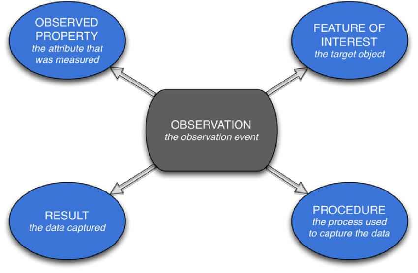

The [FAIR principles](https://www.go-fair.org/fair-principles/) are a good practice on data sharing in academic communities and beyond. A good starting point for our workshop on data management. 

:::{.border .p-2 .mb-3 .bg-light .border-rounded}
Outside academia there have been similar initiatives to improve data management, which may be more relevant for dedicated communities or scenarios:

- [5 star open data](https://5stardata.info)
- [W3C Data on the web best practices](https://www.w3.org/TR/dwbp/) 
- [Open government data principles](https://public.resource.org/8_principles.html)
- [European INSPIRE Directive](https://inspire.ec.europa.eu/inspire-directive/2)
:::

In this paragraph we present a number of exercises around the FAIR principles. And we'll see how the principles work out in the soil domain specifically. FAIR Data is:

- [Findable](#findable)
- [Accessible](#accessible)
- [Interoperable](#interoperable)
- [Reusable](#reusable)

---

## Findable

Metadata and data should be easy to find for both humans and computers.

### Data and metadata have a unique persistent identifier

- A minimal approach to create a unique identifier ([URI](https://en.wikipedia.org/wiki/Uniform_Resource_Identifier)) is to combine a local identifier with a domain. For example: <https://data.kalro.org/profiles/aa1-49bc-d11e>
- In theory, URIs do not need to `resolve` to an actual website, but it is a good practice to provide meaningfulcontent at each uri.
- Do not use product names and project names inURIs, it is difficult to maintain persistence. 
- Frameworks such as [DOI](https://doi.org) and [ePIC](http://www.pidconsortium.net) offer a identification layer for online resources.

:::{.callout-tip}
For the following datasets, review the uniqueness and persistence of their identifier and the identifier of the data. 

- [05b1e57a-8e31-4cdb-aca4-61ae3f21559d](https://www.geoportal.org/community/guest/geoss-resources?p_p_id=geossresources_WAR_geossportlet&p_p_lifecycle=2&p_p_state=normal&p_p_mode=view&p_p_cacheability=cacheLevelPage&controlPanelCategory=current_site.configuration&p_p_resource_id=META_DATA&_geossresources_WAR_geossportlet_targetId=05b1e57a-8e31-4cdb-aca4-61ae3f21559d)
- [10.1016/j.rse.2019.111260](https://doi.org/10.1016/j.rse.2019.111260)
- [d5bb6b02-0979-5112-8dd6-9aef6638fb73](https://explorer.digitalearth.africa/stac/collections/rainfall_chirps_daily/items/d5bb6b02-0979-5112-8dd6-9aef6638fb73)
- [select-nutrition-indicators-data-for-kenya-2022](https://kenya.opendataforafrica.org/lrysdue/select-nutrition-indicators-data-for-kenya-2022)

Perform the same analyses for some datasets on your local machine or organisation network.
:::

### Describe the data source with rich metadata

Rich metadata includes aspects such as, title, abstract, keywords, who is the author/owner of the resource, when was the resource created, 
are there any usage constraints, how does the resource relate to other resources.

:::{.callout-tip}
To evaluate if a tiff-dataset containing `texture-clay` is relevant to answer your question on soil water availability, 
which aspects would you expect a metadata description of that dataset to include?
:::

### Metadata are searchable in a catalogue

In order to find metadata efficiently, metadata records should be listed in a intuitive search interface

:::{.callout-tip}
Navigate to the following data portals and search for a dataset on for example `soil texture` in your area. Note down which aspects you would like to see improved 
to locate a dataset, or to know when to stop searching, because you assume you have located the best match in the catalogue. 

- [Geoportal.org](https://www.geoportal.org)
- [Google dataset search](https://datasetsearch.research.google.com)
- [Data.isric.org](https://data.isric.org)
- [Digitalearth.africa](https://radiantearth.github.io/stac-browser/#/external/explorer.digitalearth.africa/stac/)
- [FAO catalogue](https://data.apps.fao.org/catalog/)
:::

---

## Accessible

Once a user finds the data, it should be clear how they can be accessed.

### Metadata and data are retrievable using a standardised communications protocol

Various communities adopted a range of standards for metadata exchange:

#### Metadata

| Community | Standard | Format/Protocol |
| --- | --- | --- |
| Open data/Sematic web | [DCAT](https://www.w3.org/TR/vocab-dcat-2/) | SPARQL |
| Science | Datacite | [OAI-PMH](http://www.openarchives.org/OAI/openarchivesprotocol.html) | 
| Geospatial | iso19115 | [CSW](https://www.ogc.org/standard/cat/)/OGC API - Records |
| Earth observation | [STAC Catalog](https://stacspec.org/) | STAC API |
| Search engines | [Schema.org](https://schema.org/Dataset) | json-ld/microdata |
| Ecology | EML | [KNB](https://knb.ecoinformatics.org/)/[GBIF](https://gbif.org) |

---

:::{.callout-tip}
A metadata model often is a combination of a schema and a format. Compare the following metadata records, identify which model is used in the record, what differences and communalities do you notice? 

- [African open soil data](https://api.datacite.org/dois/10.17605/OSF.IO/A69R5)
- [Wosis latest](https://data.isric.org/geonetwork/srv/metadata/2f99e10f-183c-11e9-aba8-a0481ca9e724/formatters/xml)
- [Rainfall Chirps](https://explorer.digitalearth.africa/stac/collections/rainfall_chirps_daily/items/d5bb6b02-0979-5112-8dd6-9aef6638fb73)
- [Soil excavation Assen](https://data.europa.eu/api/hub/repo/datasets/dataset-bodem-ontgravingskaart-bovengrond-assen.ttl)
- [Keileem Drenthe](https://demo.pygeoapi.io/master/collections/dutch-metadata/items/ffffffaa-4087-59ec-9ea7-8416f58e99dd?f=jsonld)
:::

#### Data

Most common in data science is to provide a packaged version of a dataset and deploy it on a repository like Zenodo or Dataverse where it can be downloaded. Zenodo supports Findability and Accessibility of FAIR.

In the spatial and earth observation domain we tend to work with large files and the use of data APIs which allow to request subsets of the data are very common. The Open Geospatial Consortium has defined a number of standards for these APIs, so the APIs themselves are interoperable. The table below shows some of the common APIs. In the first column the older APIs, developed in the 90's, in the second column their updated representative, recently adopted or still in development. 

| Service | OGC API | Description |
| --- | --- | --- |
| Web Map Service ([WMS](https://www.ogc.org/standard/wms/)) | [Maps](https://ogcapi.ogc.org/maps/) | Provides a visualisation of a subset of the data |
| Web Feature Service ([WFS](https://www.ogc.org/standard/wfs/)) | [Features](https://ogcapi.ogc.org/features/) | API to request a subset of the vector features |
| Web Coverage Service ([WCS](https://www.ogc.org/standard/wcs/)) | [Coverages](https://ogcapi.ogc.org/coverages/) | API to interact with grid sources |
| Sensor Observation Service ([SOS](https://www.ogc.org/standard/sos)) | [Sensorthings](https://www.ogc.org/standard/sensorthings/) | Retrieve subsets of sensor observations |

From the Earth Observation domain, an alternative mechanism is increasingly getting adopted. Complete files are stored on a public file repository, by creating an index on the file and enabling range requests, users are able to fetch subsets from the file directly (for which previously, you would have needed a WFS or WCS service).

This mechanism is enabled by new formats such as [Cloud Optimised GeoTiff](https://www.cogeo.org/), [GeoZarr](https://github.com/zarr-developers/geozarr-spec), and [GeoParquet](https://geoparquet.org/).

### The protocol allows for an authentication and authorisation procedure, where necessary

FAIR endorses open access, however in some cases it is not possible to share some data to the global audience (privacy, economic, or safety concerns). It is still relevant to publish the data, so those authorised can access it. This requires a proper level of authorisation and authentication being set up.

### Metadata are accessible, even when the data are no longer available

Metadata models usually have a status field, which enables you to indicate that a resource has been archived. The metadata would still be available, so users are aware it once existed.

---

## Interoperable

Data typically are integrated with other data, as well as interoperate with applications or workflows for analysis, storage, and processing.

### (Meta)data use a formal, accessible, shared, and broadly applicable language for knowledge representation.

The soil community has a long history of interoperability efforts for soil profile data. Such as:

- [Globalsoilmap](https://www.isric.org/projects/globalsoilmapnet) 
- [e-Soter](#e-soter)
- [iso28258:2013](#iso282582013) 

#### e-Soter

The e-Soter model has been developed in the [e-Soter Research project](https://esoter.net), based on principles of previous SOil TERrain (SOTER) initiatives. e-Soter is a relational database model, usually implemented as a [Microsoft Access](https://www.microsoft.com/en-us/microsoft-365/access) database. Some examples of e-Soter implementations:

- [Malawi](https://data.isric.org/geonetwork/srv/eng/catalog.search#/metadata/60803da0-a15f-4cc5-9cb5-172fa2460af3)
- [Kenya](https://data.isric.org/geonetwork/srv/eng/catalog.search#/metadata/73e27136-9efe-49e4-af35-fd98b841d467)
- [Southern Africa](https://data.isric.org/geonetwork/srv/eng/catalog.search#/metadata/3571c1f3-159d-442c-b324-0af53d03f12e)
- [Senegal and Gambia](https://data.isric.org/geonetwork/srv/eng/catalog.search#/metadata/a6320590-0899-4b60-bf4d-f80282bbb72c)

#### iso28258:2013

In 2012 various experts in the soil domain grouped around the development of the first formally standardised domain model on soil data, published as [ISO28258](https://www.iso.org/standard/44595.html). 
ISO28258 adopted the [Observations & Measurements](https://www.ogc.org/standard/om/) conventions of OGC. Each observation on a site, profile, horizon or soil sample is considered an observation. For each observation on a specimen, the measured property and the procedure are captured. 

{.w-50}

:::{.callout-tip}
For this exercise we are considering a dataset on observations on soil properties (either field or lab). 
If you are aware of such a dataset in your organisation or region, use that one, else you can use the [KENSOTER](https://data.isric.org/geonetwork/srv/eng/catalog.search#/metadata/73e27136-9efe-49e4-af35-fd98b841d467) dataset. Then answer the following questions:

- Describe the dataset; by region, format, organisation, date, ...
- In which column/property are the observed result values stored?
- How is the observation linked to the location and depth of the sample?
- Where is documented the unit used for the value?
- How is documented which soil property is measured
- Where is described which procedure/method has been used for this observation?
- Are metadata about the measurement available, when was the sample analysed, who made the sample, which lab?
:::

Various initiatives adopted ISO28258, and serialised and specialised the model for their community:

- [INSPIRE Soil](https://inspire.ec.europa.eu/Themes/127/2892) (Europe) and [ANZSoilML](https://github.com/ANZSoilData/ANZSoilML) (Australia) are domain models based on Observations and Measurements, inspired by ISO28258, serialised in GML. 
- [ISO28258-relational](https://git.wur.nl/isric/databases/iso28258-public) is an implementation of ISO28258 modelled as a relational database.
- [Glosis Web Ontology](https://github.com/glosis-ld/glosis) is an evolution of iso28258, using common ontologies from the web, such as [semantic sensor network](https://www.w3.org/TR/vocab-ssn/).

Some examples of datasets modelled as INSPIRE Soil:

- [Soil Berlin](https://fbinter.stadt-berlin.de/fb/atom/SO/SO_BoKw2015.zip)
- [Soil chemistry Flanders](https://www.dov.vlaanderen.be/geoserver-inspire/wfs?typeNames=so:chemicalParameter&service=wfs&version=2.0.1&request=getfeature&count=10)
- [Soil Poland](http://mapy.geoportal.gov.pl/wss/service/ATOM/httpauth/download/?fileId=07dc98d25569532b4de0d85b84f52a08&name=pomorskie_5k.zip)

:::{.callout-tip}
Download a Soil GML file and try to open it in [QGIS](https://qgis.org). QGIS usually is able to display the profile locations. Alternatively you can use the [GML Appschema format in OGR](https://gdal.org/drivers/vector/gmlas.html) to generate first a SQLite database of the file, before opening it in QGIS.
:::

### (Meta)data use vocabularies that follow FAIR principles

A number of common vocabularies are relevant to the soil domain.

The [World Reference Base for soil resources](https://github.com/iuss-wrb/wrb/releases/download/v4.0-2022/WRB_fourth_edition_2022-12-18.pdf) provides a framework of code lists on soil and soil classification. These lists are partially published in [Agrovoc](https://agrovoc.fao.org/browse/agrovoc/en/page/?clang=nb&uri=c_89f35c33) and partially in [Glosis web ontology](https://vocab.isric.org/glosis_cl).

:::{.callout-tip}
Examine the concept [Durisols](
http://aims.fao.org/aos/agrovoc/c_51ec138f) in agrovoc.

- Notice that the agrovoc page on [Durisols](https://agrovoc.fao.org/browse/agrovoc/en/page/c_51ec138f?clang=nb) looks nicer then the [representation linked to its uri](http://aims.fao.org/aos/agrovoc/c_51ec138f). Still it is important to use the persistent identifier when linking to the concept, why?
- Notice that Agrovoc contains many translations for each concept and linkage to wider and narrower terms. These are some of the benefits of linking to a keyword from a common thesaurus.
:::

### Metadata include qualified references to other metadata

The context of a dataset gets more clear if you link it to datasets which were used as a source, documents in which it is described, tools with which it has been produced or which tool can be used to view/process it, policies for which it has been created, etc. Consider that users also may traverse the link, to find datasets relevant to a certain policy or tool. 

---

## Reusable

Reuse of data is the main goal of FAIR, facilitated by documentation of the data, for different audiences.

### Use a clear and accessible data usage license

Users are very interested to know if and how they can use the data. This process is facilitated by adoption of a commonly available license, such as [odbl](https://opendatacommons.org/licenses/odbl/) or [cc-by](https://creativecommons.org/licenses/by/4.0/deed.en), so users (and machines) can identify the applicable license without reading a full document.

:::{.callout-tip}
Does your organisation provide guidance on which license to use on various data sources? Is it clear when, and when **not** to use an open license? Are you aware of any data sources which currently do not yet have an assigned data license?
:::

### Data are associated with detailed provenance

Provenance is the process of creation and curation of a data source. Which data sources or procedures were used to create the data source. Which processing steps have been applied to the data. What is the lifecycle of the dataset (when will it be archived).

This information is very relevant to potential users of the data, because they can understand if the data has been produced according to their expectations. 

In academia provenance and processing are usually described in scientific articles. One can also capture these aspects in a linked metadata record. Some tools (for example ArcGIS and SPSS) create a processing log automatically.

---

## Summary

In this section you learned about the FAIR principles and how this applies to the soil data community. In the next sections we will introduce a data management strategy we use on some of our projects. We expect some of the presented tools may be worthwile to have a closer look at, to see if it can support you in your daily tasks.