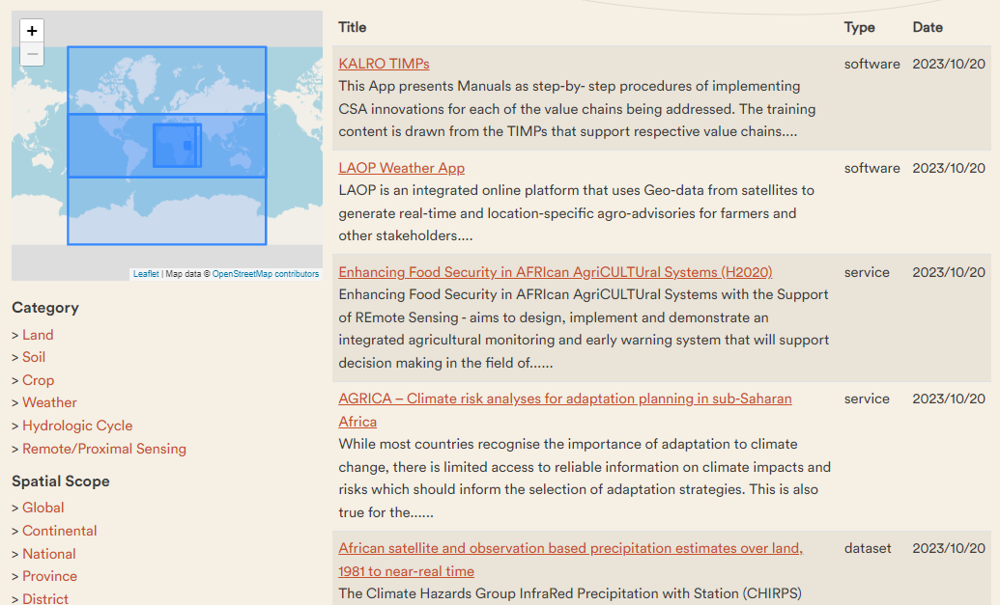

This document is a guideline for the components of a LSC Hub.

A typical LSC hub consists of 3 components:

- A [content section](#content-section) providing a user welcome, project attribution and documentation; 
- A [catalogue section](#catalogue-section) which provides a search interface on the resources relevant to the hub;
- A [map vizualisation](#map-vizualization) section for easy access to data.

Moreover, there are 2 services important for the LSC hub:
- Proving [feedback section](#feedback-section) to improve the LSC-hub
- Proving [Adding data section](#addingdata-section) to list more relevant information.

## Content section

The entry point of the hub is a webpage with general information about the project.
The LSC-hub for Rwanda can be accessed at https://lsc-hubs.org/hubs/rwanda/.

When arriving on the homepage, you can see 6 sections:
- **Data** to find data in the [catalogue](https://rwanda.lsc-hubs.org/) or go to the [mapviewer](https://maps.lsc-hubs.org/#lsc-rwanda)
- **Predictive modelling** to find modelling software in the [hub catalogue](https://rwanda.lsc-hubs.org/collections/metadata:main/items?type=model).
- **Policy** Which [policies](https://lsc-hubs.org/hubs/rwanda/policy/) are relevant to the hub, and can the hub support policy development?
- **Information Services** to find [agricultural knowledge and innovation systems](https://lsc-hubs.org/hubs/rwanda/akis/) in Rwanda
- **Use Cases** to explore the [use cases](https://lsc-hubs.org/hubs/rwanda/usecases/) of the LSC hub
- **Hub community** to find other users in the [stakeholder list](https://lsc-hubs.org/hubs/rwanda/stakeholders/)

  add new image

Step 1: explore the different sections of the LSC hub. Click on all the links, and explore which info is in there.

## Catalogue section

The central catalogue contains references to all relevant resources in the hub. For each reference, a number of metadata properties are provided, such as abstract, keywords, usage constraints, and contact information.

Resources are categorised into:

- Datasets
- Software 
- Model
- Services (Web services, APIs, SMS, phone and onsite services)

The catalogue allows to filtering of a resultset by relevant filters. 

Some records link to a resource preview option in the [map vizualization](#map-vizualization) component.

Read more about the capabilities of the catalogue component at [pycsw](https://docs.pycsw.org/en/latest/).

## Map visualization

Spatial data can be viewed and compared in a web-based map viewer. You can open one of the existing map contexts via the `related maps` menu. Or create a map from scratch by combining datasets found in the catalogue or from other sources.

A listing of available functionalities:

- The Sidebar
    - `Explore map data` shows a listing of datasets which can be added to the map, either via a catalogue search or directly from a configured map service. If the panel is empty, select an alternative map from `related maps`.
    - `Upload` provides the option to open a dataset from the local computer. Note that this data is not uploaded to a server, so this data is not shared with colleagues. You can also reference `web data` from this panel.
    - As soon as layers are loaded on the map, you can set the order of the layers, view a legend of the layer, zoom to its extent, set its opacity and view the metadata of the data. 
- The vertical toolbar on the top right
    - Zoom in and out, and back to a full world zoom
    - Zoom to your current location
    - Split the map in the left and right, to compare 2 datasets
    - Measure a distance on the map
- The top menu
    - Get more information `about` the map viewer
    - Select one of a set of `related maps`
    - `Map settings` allows to select a different base map
    - `Help` opens the viewer documentation
    - A `Story` is a series of views on various datasets with comments
    - `Share` generates a link to the current map, which you can share with collegues  

Read more about the capabilities of the component at [terriajs](https://docs.terria.io/guide/).

## Feedback section

Notice that every page or resource on the hub provides an option to provide feedback and/or ask a question related to the content. Contributions to the hub require a [Github login](https://github.com/signup?ref_cta=Sign+up).

## Adding data section
