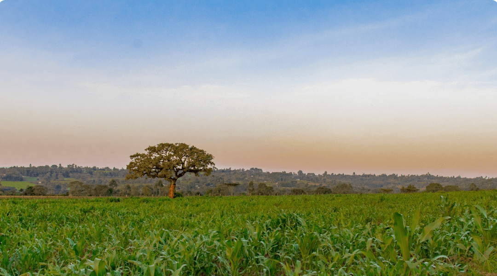
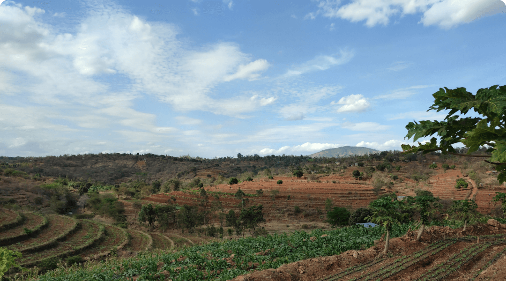

::: {.page-section section_name='intro'}
:::: {.grid}

::::: {.g-col-12 .g-col-md-7 .g-col-lg-6}

# Land, Soil and Crop Information Hub 

The Land, Soil and Crop (LSC) hub facilitates effective access to land soil and crop information data by making existing resources better findable, accessible, interoperable and reusable.

The LSC hub promotes improved decision-making for climate-smart agriculture at national, regional and local levels. It can be utilised, for example, for 
[soil fertility management](/cases/isfm.html) and [soil water conservation](/cases/swc.html)

The LSC hub is being developed as part of the Land, Soil and Crop Information Services (LSC-IS) to support Climate-Smart Agriculture (DeSIRA) project in East Africa. 
[Read more about the project](https://lsc-hubs.org/).

:::::

::::: {.g-col-12 .g-col-md-5 .g-start-lg-8}

:::::

::::
:::


::: {.page-section has_bg_color=true section_name='data'}
:::: {.grid}

::::: {.g-col-12 .text-center .mx-auto}
## Data and Information

The LSC hub offers a diverse range of datasets, maps and documents, including observational data from field studies (e.g., soil and water samples, crop yields), aerial and space observations, administrative boundaries, economic data (price development), predictive model outputs (soil, weather, yields), and population statistics.
:::::

::::: {.g-col-12}
```{=html}
<form class="section-data__form d-flex" action="/collections/metadata:main/items" method="GET">
  <label class="visually-hidden" for="searchDataCatalogue">
    Search data catalogue
  </label>
  <input
    type="text"
    class="section-data__form__input form-control form-control-lg"
    id="searchDataCatalogue"
    placeholder="Search data catalogue"
  >

  <button type="submit" class="section-data__form__submit btn btn-lg">
    <i class="bi-search"></i>
  </button>
</form>
```

:::::: {layout="[1.5,1,1,1,1,1]" .text-center}
**Browse by category**

/collections/metadata:main/items?q=&keywords=Land" link_color="black" >}}

/collections/metadata:main/items?q=&keywords=Soil" link_color="black" >}}

/collections/metadata:main/items?q=&keywords=Crop" link_color="black" >}}

/collections/metadata:main/items?q=&keywords=Climate" link_color="black" >}}

/collections/metadata:main/items?q=&keywords=Water" link_color="black" >}}
::::::

:::::

::::: {.g-col-12 .g-col-md-6 .mt-md-4 .text-center}
[Browse Information services](/collections/metadata:main/items?q=&type=service){.fw-bold}\
for dedicated information derived from relevant data to a targeted audience.
:::::

::::: {.g-col-12 .g-col-md-6 .mt-md-4 .text-center}
[Browse Predictive modeling](/collections/metadata:main/items?q=&type=model){.fw-bold}\
for data-driven analytical approaches that involve the use of statistical or machine learning techniques.
:::::

::::
:::


::: {.page-section section_name='maps'}
:::: {.grid}

::::: {.g-col-12 .text-center .mx-auto}
## Maps

The interactive mapviewer enables direct interaction with data.\
View existing, reference remote or upload local data.\
Need help? Find info and documentation [here](/docs/user/index.md#map-viewer).

[Open map viewer](){.btn .btn-primary .my-3}
:::::

::::: {.g-col-12 .text-center .mt-4}
**Popular maps**
:::::

::::: {.g-col-12 }
:::::: {#popular-maps .grid}
Loading popular maps...
::::::
:::::

::::
:::


::: {.page-section has_bg_color=true section_name='user-stories'}
:::: {.grid}

::::: {.g-col-12 .text-center .mx-auto .mb-4}
## User stories

The cases below are descriptions of key applications for which the LSC hub can be used, including the main stakeholders, the main issues and the models through which ‘LSC data’ is converted into information services that support informed decision making.
:::::

::::: {.g-col-12 .g-col-md-6 .bg-dark .text-white .me-lg-3 .rounded}
{.rounded-top}

:::::: {.px-5 .pb-5 .pt-1}
### Soil Fertility Management

Current fertilizer and soil recommendations lack local context, leading to soil health decline and lower productivity. Integrated Soil Fertility Management can improve practices, boost yields, and provide climate benefits. This case aims to deliver better agronomic advice to farmers via agricultural extension services or directly, using existing data and tools.






::::::
:::::

::::: {.g-col-12 .g-col-md-6 .bg-dark .text-white .ms-lg-3 .rounded}
{.rounded-top}

:::::: {.px-5 .pb-5 .pt-1}
### Soil Water Conservation

Soil erosion threatens sustainability, climate, and food security in hilly regions of Ethiopia, Kenya, and Rwanda. Current land practices neglect local factors and erosion risks. The goal is to inform stakeholders and promote sustainable land practices for LDN, providing catchment managers and farmers with relevant information through the LSC-hub.






::::::
:::::

::::
:::


::: {.page-section section_name='dashboard'}
:::: {.grid}

::::: {.g-col-12 .text-center .mx-auto}
## Dashboard

Lorem ipsum dolor sit amet, consectetur adipiscing elit. Aenean venenatis, orci sit amet ornare mattis, libero nunc malesuada enim, a viverra ante metus ac ipsum.
:::::

::::: {.g-col-12 .mt-4}
:::::: {.grid}
::::::: {.g-col-12 .g-col-md-4 .shadow .px-4 .pb-3}
### Obstruction depth reason {.fs-6 .fw-bold}

<iframe class="section-dashboard__iframe" width="100%" seamless frameBorder="0" scrolling="no"
  src="https://dashboards.isric.org/superset/explore/p/eMPrE19or6D/?standalone=1&height=400"
></iframe>
:::::::

::::::: {.g-col-12 .g-col-md-4 .shadow .px-4 .pb-3}
### Reason not used for agriculture {.fs-6 .fw-bold}

<iframe class="section-dashboard__iframe" width="100%" seamless frameBorder="0" scrolling="no"
  src="https://dashboards.isric.org/superset/explore/p/KlVYWOyZYEk/?standalone=1&height=400"
></iframe>
:::::::

::::::: {.g-col-12 .g-col-md-4 .shadow .px-4 .pb-3}
### Security concerns {.fs-6 .fw-bold}

<iframe class="section-dashboard__iframe" width="100%" seamless frameBorder="0" scrolling="no"
  src="https://dashboards.isric.org/superset/explore/p/w1nRjP9KYEz/?standalone=1&height=400"
></iframe>
:::::::
::::::
:::::

::::: {.g-col-12 .mx-auto}
[View dashboard](https://dashboards.isric.org/superset/dashboard/soils4africa/){.btn .btn-primary .mt-5}
:::::

::::
:::


:::: {.grid }

::: {.g-col-md-6 .g-col-12 .mt-3}


## Hub community

The heart of the knowledge hub. Here, you’ll find like-minded participants who share a passion for learning and knowledge exchange.

Join our diverse community of learners, experts, and enthusiasts to engage in discussions, share insights, and collaborate on soil fertility and soil water conservation topics. Explore, connect,  contribute and make the hub grow.

::: {.text-center .mt-2}
[Visit community](){.btn .btn-success .rounded-pill}
:::

:::

::: {.g-col-md-6 .g-col-12 .mt-3}


:::

::::

::: {.special-section}

::: {.text-light .bg-dark .px-3 .rounded}

:::: {.grid }

::: {.g-col-md-6 .g-col-12 .px-3 }


## Join our newsletter {.text-light}

Subscribe to our newsletter and be the first to receive the latest data updates and community news about the  Land Soil and Crop hub.

::: {.text-center .mt-2}
[Subscribe now](https://capacity4dev.europa.eu/join-community_en){.btn .btn-success .rounded-pill}
:::

::: 

::: {.g-col-md-6 .g-col-12 .mt-2}


:::

::::

:::

:::

